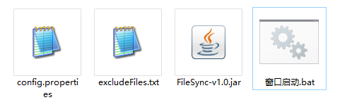
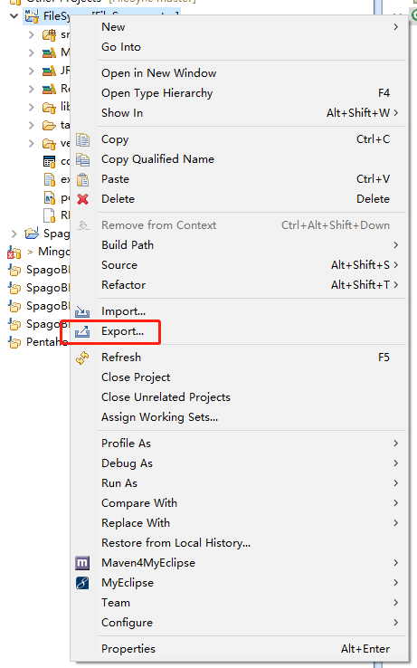
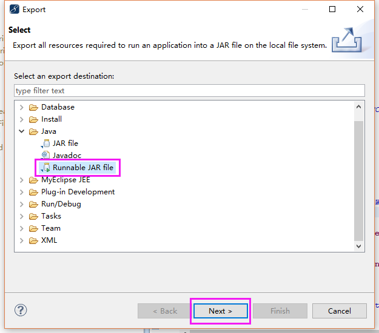
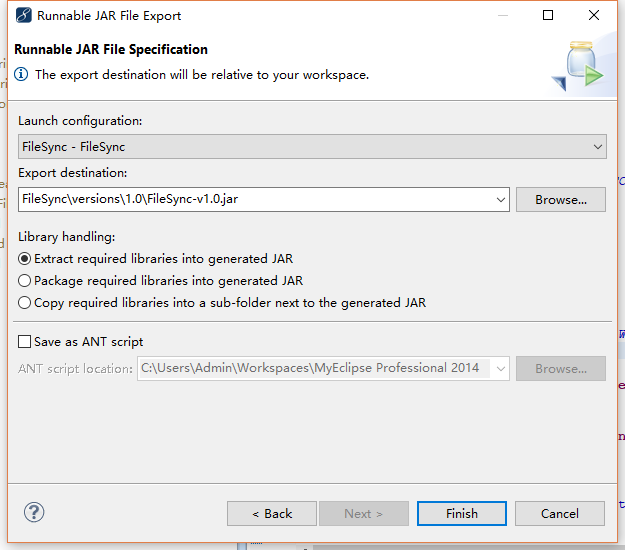

# FileSync
将本地多个文件夹的内容实时同步到另外一个文件夹中



### 使用命令行
```
java -jar FileSync-v1.0.jar
```
或直接点击“窗口启动.bat”运行

### config.properties配置
```
# 监视目录。
watchPath=D\:\\a\\

# 同步目标目录。
syncPath=D\:\\b\\

# 差异判断周期，单位秒。
# 默认 2 秒。
watchInterval=2

# 排除的文件类型。
# 如：log,project
excludeExts=project,log,gitignore
```

或使用 excludeFiles.txt 目录来指定要排除的文件或文件夹。

### 手动打包

1、先将目录导入到 MyEclipse

2、在目录右键


3、选择导出为 Runnable JAR file


4、选择主类和导出的文件


5、Finish

### 服务化
现有目录里已经自带了 Windows 服务安装工具，简单配置 serviceInstaller/config.properties 文件。